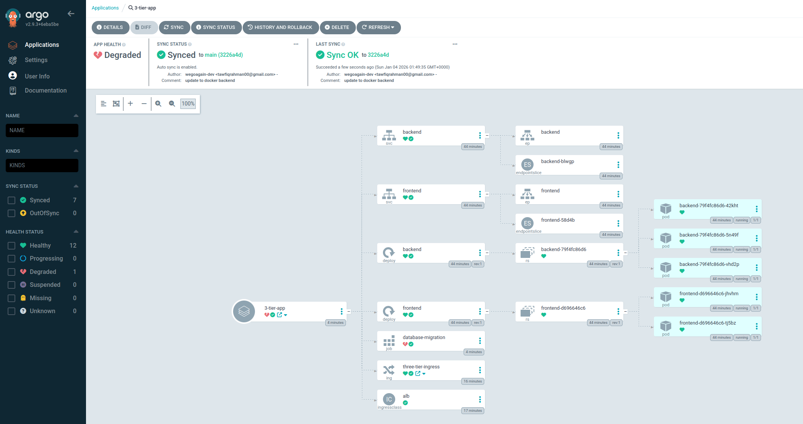

## About the Project

In this project, I deploy a three tier application (React frontend, Flask backend, PostgreSQL on RDS) to AWS EKS. Everything is managed through **Terraform**, including the VPC, EKS cluster, RDS database, and all the supporting infrastructure.

For CI/CD, I use **GitHub Actions** with OIDC authentication to push images to **ECR**, and **ArgoCD** handles the GitOps deployment. Observability is covered by the **Prometheus/Grafana** stack.

## Architecture & Design Decisions

Before jumping into the implementation, let me walk through the architectural choices.

<details open>
<summary><strong>Why Terraform for Everything?</strong></summary>

I originally started with `eksctl` for the cluster, but quickly realised that having infrastructure split between eksctl and Terraform made things messy. By moving everything to Terraform, I get a single source of truth. The VPC, EKS cluster, RDS, ECR repositories, IAM roles, and even the Kubernetes resources like namespaces and secrets are all defined in one place.

This also means I can spin up or tear down the entire environment with `terraform apply` and `terraform destroy`. No more forgetting to delete that one manually created resource.

</details>

<details>
<summary><strong>Why Managed Node Groups?</strong></summary>

EKS gives you three options for compute: self managed nodes, managed node groups, or Fargate. I went with managed node groups because they strike a good balance. AWS handles the AMI updates and node lifecycle, but I still have control over instance types and scaling. Fargate would be simpler but costs more for sustained workloads, and self managed nodes are overkill for this project.

</details>

### High Level Flow

1. **User Request**: Traffic comes in through an AWS Application Load Balancer (ALB)
2. **Ingress Controller**: The AWS Load Balancer Controller routes `/api` to the backend and `/` to the frontend
3. **Application Layer**: React frontend and Flask API running in pods
4. **Data Layer**: RDS PostgreSQL in isolated database subnets, accessible only from the EKS worker nodes

---

## Prerequisites

You will need **aws cli**, **kubectl**, **terraform**, and **docker** installed locally. I am assuming you have basic familiarity with Kubernetes and AWS.

## Cloning the Repository

```bash
git clone https://github.com/wegoagain-dev/3-tier-eks.git
cd 3-tier-eks
```

## Step 1: Understanding the Terraform Structure

> ⚠️ **Cost Warning**: EKS costs roughly $0.10/hour for the control plane, plus EC2 costs for the nodes. Remember to destroy everything when you are done!

The `terraform/` directory contains all the infrastructure code:

```
terraform/
├── provider.tf      # AWS, Kubernetes, Helm providers + S3 backend
├── variables.tf     # All configurable values
├── vpc.tf           # VPC with public, private, and database subnets
├── eks.tf           # EKS cluster using terraform-aws-modules
├── rds.tf           # PostgreSQL RDS in database subnets
├── k8s.tf           # Namespace, ConfigMap, Secrets, ExternalName service
├── lb_controller.tf # AWS Load Balancer Controller via Helm
├── argocd.tf        # ArgoCD installation via Helm
├── monitoring.tf    # Prometheus and Grafana stack
├── ecr.tf           # ECR repositories for frontend and backend
├── github_oidc.tf   # OIDC provider for GitHub Actions
└── outputs.tf       # Useful outputs like RDS endpoint
```

### The VPC Setup

I use the `terraform-aws-modules/vpc/aws` module to create a proper network layout:

```hcl
module "vpc" {
  source  = "terraform-aws-modules/vpc/aws"
  version = "~> 5.1.0"

  name = var.cluster_name
  cidr = var.vpc_cidr

  azs              = var.azs
  public_subnets   = var.public_subnets
  private_subnets  = var.private_subnets
  database_subnets = var.database_subnets

  enable_nat_gateway = true
  single_nat_gateway = true  # Saves money for dev environments

  enable_dns_hostnames = true
  enable_dns_support   = true

  # Tags required for EKS to discover subnets
  public_subnet_tags = {
    "kubernetes.io/role/elb" = "1"
  }
  private_subnet_tags = {
    "kubernetes.io/role/internal-elb" = "1"
  }
}
```

The key bit here is the three tier subnet layout:
- **Public subnets**: Where the ALB lives
- **Private subnets**: Where the EKS nodes run (they get internet access via NAT Gateway)
- **Database subnets**: Completely isolated, no internet access at all

### The EKS Cluster

The EKS module handles all the heavy lifting:

```hcl
module "eks" {
  source  = "terraform-aws-modules/eks/aws"
  version = "~> 19.0"

  cluster_name    = var.cluster_name
  cluster_version = "1.31"

  vpc_id     = module.vpc.vpc_id
  subnet_ids = module.vpc.private_subnets

  eks_managed_node_groups = {
    standard-workers = {
      instance_types = ["t3.medium"]
      min_size       = 1
      max_size       = 3
      desired_size   = 2

      iam_role_additional_policies = {
        AmazonEKSWorkerNodePolicy          = "arn:aws:iam::aws:policy/AmazonEKSWorkerNodePolicy"
        AmazonEKS_CNI_Policy               = "arn:aws:iam::aws:policy/AmazonEKS_CNI_Policy"
        AmazonEC2ContainerRegistryReadOnly = "arn:aws:iam::aws:policy/AmazonEC2ContainerRegistryReadOnly"
        CloudWatchAgentServerPolicy        = "arn:aws:iam::aws:policy/CloudWatchAgentServerPolicy"
      }
    }
  }

  enable_irsa                    = true
  cluster_endpoint_public_access = true
}
```

The `enable_irsa = true` is important. This sets up an OIDC provider for the cluster, which lets Kubernetes ServiceAccounts assume IAM roles. The AWS Load Balancer Controller needs this to create ALBs on our behalf.

---

## Step 2: The Database Layer

The RDS instance sits in the database subnets with a security group that only allows traffic from the EKS nodes:

```hcl
resource "aws_security_group" "rds" {
  name   = "${var.cluster_name}-rds-sg"
  vpc_id = module.vpc.vpc_id

  ingress {
    from_port       = 5432
    to_port         = 5432
    protocol        = "tcp"
    security_groups = [module.eks.node_security_group_id]
  }
}

resource "aws_db_instance" "db" {
  allocated_storage      = 20
  engine                 = "postgres"
  engine_version         = "16.8"
  instance_class         = var.db_instance_class
  db_name                = var.db_name
  username               = var.db_username
  password               = random_password.password.result
  db_subnet_group_name   = aws_db_subnet_group.rds.name
  vpc_security_group_ids = [aws_security_group.rds.id]
  skip_final_snapshot    = true
}
```

The password is generated using `random_password` and stored in AWS Secrets Manager. No hardcoded credentials floating about.

### The Kubernetes Bridge

This is where it gets interesting. Terraform creates Kubernetes resources that bridge AWS and the cluster:

```hcl
# Namespace for our app
resource "kubernetes_namespace" "app" {
  metadata {
    name = "3-tier-app-eks"
  }
  depends_on = [module.eks]
}

# Secret containing the database connection string
resource "kubernetes_secret" "database_secret" {
  metadata {
    name      = "database-secret"
    namespace = kubernetes_namespace.app.metadata[0].name
  }
  data = {
    DATABASE_URL = aws_secretsmanager_secret_version.db_string_version.secret_string
  }
}

# ExternalName service pointing to RDS
resource "kubernetes_service" "postgres_db" {
  metadata {
    name      = "postgres-db"
    namespace = kubernetes_namespace.app.metadata[0].name
  }
  spec {
    type          = "ExternalName"
    external_name = aws_db_instance.db.address
  }
}
```

The `ExternalName` service is particularly useful. Instead of hardcoding the RDS endpoint everywhere, pods can connect to `postgres-db:5432`. If the RDS endpoint ever changes, I only update it in one place.

---

## Step 3: Deploying the Infrastructure

Before running Terraform, you need to create an S3 bucket for the state file. The backend is configured in `provider.tf`:

```hcl
backend "s3" {
  bucket       = "devops-quiz-terraform-state"
  key          = "dev/terraform.tfstate"
  region       = "eu-west-2"
  encrypt      = true
  use_lockfile = true
}
```

Create the bucket manually first, then:

```bash
cd terraform
terraform init
terraform apply
```

This will take about 15 to 20 minutes. Terraform creates the VPC, EKS cluster, RDS instance, ECR repositories, and installs the AWS Load Balancer Controller, ArgoCD, and Prometheus stack via Helm.

Once done, configure kubectl:

```bash
aws eks update-kubeconfig --name devops-quiz --region eu-west-2
kubectl get nodes
```

---

## Step 4: CI/CD with GitHub Actions

The CI/CD pipeline uses OIDC to authenticate with AWS. No long lived credentials stored in GitHub Secrets.

### OIDC Setup

Terraform creates an OIDC provider that trusts GitHub:

```hcl
resource "aws_iam_openid_connect_provider" "github" {
  url             = "https://token.actions.githubusercontent.com"
  client_id_list  = ["sts.amazonaws.com"]
  thumbprint_list = ["6938fd4d98bab03faadb97b34396831e3780aea1"]
}

resource "aws_iam_role" "github_actions" {
  name = "GitHubActionsECR"

  assume_role_policy = jsonencode({
    Version = "2012-10-17"
    Statement = [{
      Action = "sts:AssumeRoleWithWebIdentity"
      Effect = "Allow"
      Principal = {
        Federated = aws_iam_openid_connect_provider.github.arn
      }
      Condition = {
        StringLike = {
          "token.actions.githubusercontent.com:sub" = "repo:${var.github_repo}:*"
        }
      }
    }]
  })
}
```

### The Workflow

The GitHub Actions workflow does the following:

1. Checks out the code
2. Authenticates with AWS using OIDC
3. Builds the Docker images
4. Runs Trivy vulnerability scanning (fails on CRITICAL vulnerabilities)
5. Pushes to ECR if scans pass
6. Updates the Kubernetes manifests with the new image tags
7. Commits and pushes the changes

```yaml
- name: Build frontend image
  run: |
    docker build -t $ECR_REGISTRY/$ECR_REPOSITORY_FRONTEND:$IMAGE_TAG ./frontend

- name: Run Trivy vulnerability scanner
  uses: aquasecurity/trivy-action@master
  with:
    image-ref: ${{ steps.login-ecr.outputs.registry }}/${{ env.ECR_REPOSITORY_FRONTEND }}:${{ github.sha }}
    exit-code: "1"
    severity: "CRITICAL"

- name: Push Frontend image to ECR
  if: success()
  run: |
    docker push $ECR_REGISTRY/$ECR_REPOSITORY_FRONTEND:$IMAGE_TAG
```

The last step updates the image tags in the Kubernetes manifests and commits them back to the repo. This is the GitOps bit. ArgoCD watches the repo and syncs any changes to the cluster.

---

## Step 5: Deploying the Application

### Update Image References

Before deploying, update the image URIs in `k8s/backend.yaml`, `k8s/frontend.yaml`, and `k8s/migration_job.yaml` to use your ECR repository:

```
<your-account-id>.dkr.ecr.<region>.amazonaws.com/3-tier-eks-backend:latest
<your-account-id>.dkr.ecr.<region>.amazonaws.com/3-tier-eks-frontend:latest
```

### Run the Database Migration

The backend needs database tables before it can run. A Kubernetes Job handles this:

```bash
kubectl apply -f k8s/migration_job.yaml
kubectl get jobs -n 3-tier-app-eks
```

Wait for it to complete:

```bash
kubectl get pods -n 3-tier-app-eks
```

### Deploy the Services

```bash
kubectl apply -f k8s/backend.yaml
kubectl apply -f k8s/frontend.yaml
```

### Apply the Ingress

The ingress routes traffic:
- `/api/*` goes to the backend
- `/` goes to the frontend

```bash
kubectl apply -f k8s/ingress.yaml
```

Give it a few minutes for the ALB to provision:

```bash
kubectl get ingress -n 3-tier-app-eks
```

Copy the ADDRESS and open it in your browser.

<video width="650" height="300" controls>
  <source src="/quiz-demo.mov" type="video/mp4" />
  Your browser does not support the video tag.
</video>

---

## Step 6: GitOps with ArgoCD

ArgoCD is installed via Terraform, but you need to create an Application resource to tell it what to sync.

Create `k8s/argocd-app.yaml`:

```yaml
apiVersion: argoproj.io/v1alpha1
kind: Application
metadata:
  name: devops-quiz
  namespace: argocd
spec:
  project: default
  source:
    repoURL: https://github.com/wegoagain-dev/3-tier-eks.git
    targetRevision: main
    path: k8s
  destination:
    server: https://kubernetes.default.svc
    namespace: 3-tier-app-eks
  syncPolicy:
    automated:
      prune: true
      selfHeal: true
```

Apply it:

```bash
kubectl apply -f k8s/argocd-app.yaml
```

Access the ArgoCD UI:

```bash
kubectl port-forward svc/argocd-server -n argocd 8080:443
```

Get the initial admin password:

```bash
kubectl get secret argocd-initial-admin-secret -n argocd -o jsonpath="{.data.password}" | base64 -d
```

Now any changes pushed to the `k8s/` folder will be automatically synced to the cluster.



---

## Step 7: Monitoring with Prometheus and Grafana

The kube-prometheus-stack is installed via Terraform. Access Grafana:

```bash
kubectl port-forward svc/prometheus-grafana -n monitoring 3000:80
```

Login with `admin` / `admin123` (set in the Terraform config).

The stack comes with dashboards for cluster health, node metrics, and pod resource usage out of the box.


---

## Troubleshooting Notes

A few things I ran into during this project:

**Ingress not getting an ADDRESS**: The AWS Load Balancer Controller needs the correct IAM policy. I initially used a v2.7 policy but the Helm chart installed v3.0 of the controller. Make sure the policy version matches by fetching from `main` branch:

```hcl
data "http" "alb_controller_policy" {
  url = "https://raw.githubusercontent.com/kubernetes-sigs/aws-load-balancer-controller/main/docs/install/iam_policy.json"
}
```

**Frontend showing "Connection Error"**: The React app was built with `localhost:8000` baked into the bundle. Fixed by changing the API config to use a relative path (`/api`) which the ALB ingress routes to the backend.

**Architecture mismatch on EKS**: Built Docker images on an M1 Mac (ARM) but EKS nodes are x86. Use `docker buildx build --platform linux/amd64` to build for the correct architecture.

---

## Cleanup

Follow these steps in order to avoid orphaned resources:

**Step 1: Delete the Ingress first** (so the ALB gets cleaned up)

```bash
kubectl delete ingress three-tier-ingress -n 3-tier-app-eks
```

Wait a minute or two for the ALB to be deleted.

**Step 2: Destroy Terraform resources**

```bash
cd terraform
terraform destroy
```

This deletes everything: EKS cluster, VPC, RDS, ECR repos, the lot.

---

## What I Would Do Next

- Add a custom domain with Route53 and ACM for HTTPS
- Set up Horizontal Pod Autoscaling based on CPU metrics
- Add network policies to restrict pod to pod communication
- Move the Grafana password to Secrets Manager

---

## Conclusion

This project covers a lot of ground: infrastructure as code with Terraform, container orchestration with EKS, secure CI/CD with OIDC, GitOps with ArgoCD, and observability with Prometheus and Grafana.

The main thing I learned is that keeping everything in Terraform makes life much easier. Having the VPC, cluster, database, and Kubernetes resources all in one place means you can reason about the whole system without jumping between different tools.

If you have any questions or spot any issues, feel free to open an issue on the repo.
