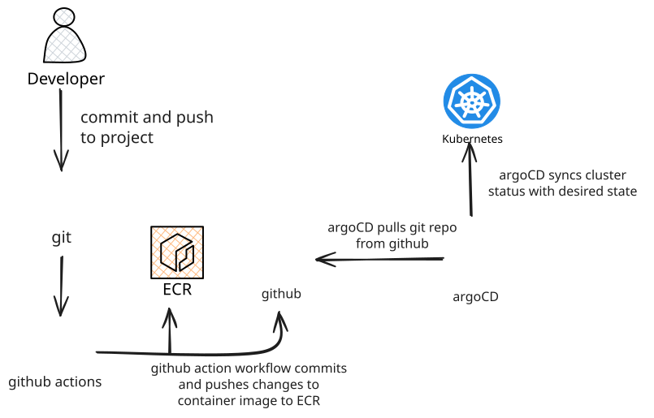
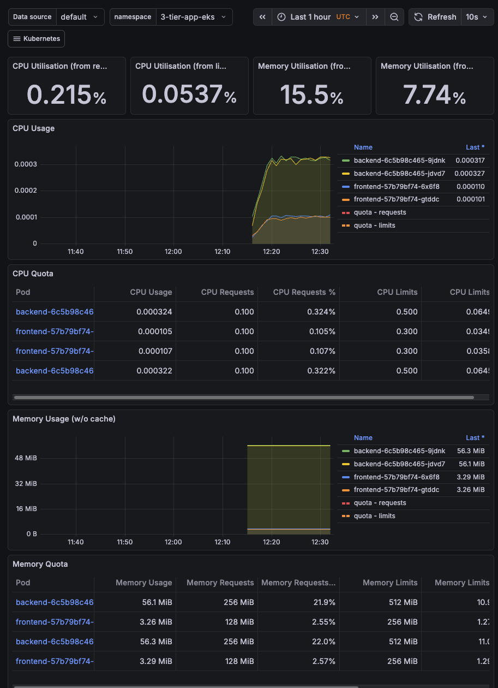

## About the Project

I built this project to get hands-on with the tools I'd actually use in a DevOps role. It's a three-tier quiz application: React frontend, Flask backend, and PostgreSQL on RDS, all running on AWS EKS.

What makes this interesting (to me at least) is the **clean separation between infrastructure and application** using the **App of Apps pattern**. Terraform manages the infrastructure (VPC, EKS, RDS, ECR, IAM roles) and installs ArgoCD. Then, a single `kubectl apply` bootstraps the entire GitOps workflow via a root Application. That root Application manages everything else - platform tools (ALB Controller, External Secrets Operator, Prometheus) and the actual application workloads - using sync waves to ensure correct deployment order.

The flow is: **Terraform → kubectl apply → Root App → Platform Apps → Workloads**. This is a production-grade GitOps architecture where Terraform creates the infrastructure and the "GitOps engine" (ArgoCD), then steps back and lets GitOps drive everything else.

I also use **External Secrets Operator** to sync secrets from AWS Secrets Manager to Kubernetes. This means no secrets in Git, and no manual secret management. Everything is automated and secure.

For CI/CD, I went with **GitHub Actions** using OIDC to authenticate with AWS. No long-lived credentials sitting in GitHub Secrets. **ArgoCD** handles the GitOps side, so any changes to the Kubernetes manifests get synced automatically. And I've got **Prometheus/Grafana** for monitoring because you can't improve what you can't measure.

If you want to see the code, it's all on [GitHub](https://github.com/wegoagain-dev/3-tier-eks).

## Architecture & Design Decisions

Let me explain why I made certain choices. Some were obvious, others I learnt the hard way.

<details open>
<summary><strong>Why Terraform for Everything?</strong></summary>

I actually started with `eksctl` for the cluster. Seemed easier at first. But then I had infrastructure in two places: some in eksctl YAML, some in Terraform. It got confusing fast.

Moving everything to Terraform meant one source of truth. The VPC, EKS cluster, RDS, ECR repos, IAM roles, all defined in one place. Now I can spin up the whole environment with `terraform apply` and tear it down with `terraform destroy`. No more "oh crap I forgot to delete that security group" moments.

</details>

<details>
<summary><strong>Why Managed Node Groups?</strong></summary>

EKS gives you three compute options: self-managed nodes, managed node groups, or Fargate.

I picked managed node groups because they hit the sweet spot. AWS handles the boring stuff: AMI updates, node lifecycle, patching. But I still control instance types and scaling.

Fargate would be simpler (no nodes to manage at all) but it costs more for sustained workloads. Self-managed nodes give you full control but that's overkill for this project. I don't want to be SSHing into nodes to update packages.

</details>

### How It All Connects

**The journey of a request:**
1. User hits the **ALB** (sitting in a public subnet)
2. **Ingress Controller** routes `/api` calls to the backend, everything else to the frontend
3. **Application Layer** React serves the UI, Flask handles the API
4. **Data Layer** RDS PostgreSQL tucked away in isolated database subnets, only accessible from the EKS nodes

---

## Prerequisites

You will need **aws cli**, **kubectl**, **terraform**, and **docker** installed locally. I am assuming you have basic familiarity with Kubernetes and AWS.

## Cloning the Repository

```bash
git clone https://github.com/wegoagain-dev/3-tier-eks.git
cd 3-tier-eks
```

## Step 1: Understanding the Terraform Structure

> **Heads up on costs**: This setup will run you about **$190-200/month** if you leave it running.
>
> | Component | What it is | Monthly Cost |
> |-----------|--------------|--------------|
> | EKS Control Plane | The Kubernetes master | ~$73 |
> | EC2 Nodes (2x) | t3.medium instances | ~$60 |
> | RDS PostgreSQL | db.t3.micro database | ~$13 |
> | NAT Gateway | So private subnets can reach the internet | ~$32 |
> | ALB | Load balancer | ~$16 |
> | **Total** | | **~$194/month** |
>
> *Based on eu-west-2 (London) pricing. Don't forget to `terraform destroy` when you're done experimenting!*

The `terraform/` directory contains all the infrastructure code:

```
terraform/
├── provider.tf          # AWS and Helm providers + S3 backend
├── variables.tf         # All configurable values
├── vpc.tf               # VPC with public, private, and database subnets
├── eks.tf               # EKS cluster using terraform-aws-modules
├── rds.tf               # PostgreSQL RDS in database subnets
├── external_secrets.tf  # IAM role for External Secrets Operator (IRSA)
├── lb_controller.tf     # IAM role for AWS Load Balancer Controller (IRSA)
├── argocd.tf            # ArgoCD installation via Helm
├── ecr.tf               # ECR repositories for frontend and backend
├── github_oidc.tf       # OIDC provider for GitHub Actions
└── outputs.tf           # Useful outputs like RDS endpoint
```

Notice what's missing: Terraform doesn't install Helm charts for platform tools directly. Instead, it creates ArgoCD, then you bootstrap GitOps with one kubectl command. The root Application then manages all platform tools via the `k8s/platform/` directory. This is the **App of Apps pattern** - Terraform bootstraps GitOps, then GitOps takes over.

### The VPC Setup

I use the `terraform-aws-modules/vpc/aws` module to create a proper network layout:

```hcl
module "vpc" {
  source  = "terraform-aws-modules/vpc/aws"
  version = "~> 5.1.0"

  name = var.cluster_name
  cidr = var.vpc_cidr

  azs              = var.azs
  public_subnets   = var.public_subnets
  private_subnets  = var.private_subnets
  database_subnets = var.database_subnets

  enable_nat_gateway = true
  single_nat_gateway = true  # Saves money for dev environments

  enable_dns_hostnames = true
  enable_dns_support   = true

  # Tags required for EKS to discover subnets
  public_subnet_tags = {
    "kubernetes.io/role/elb" = "1"
  }
  private_subnet_tags = {
    "kubernetes.io/role/internal-elb" = "1"
  }
}
```

The key bit here is the three tier subnet layout:
- **Public subnets**: Where the ALB lives
- **Private subnets**: Where the EKS nodes run (they get internet access via NAT Gateway)
- **Database subnets**: Completely isolated, no internet access at all

### The EKS Cluster

The EKS module handles all the heavy lifting:

```hcl
module "eks" {
  source  = "terraform-aws-modules/eks/aws"
  version = "~> 19.0"

  cluster_name    = var.cluster_name
  cluster_version = "1.31"

  vpc_id     = module.vpc.vpc_id
  subnet_ids = module.vpc.private_subnets

  eks_managed_node_groups = {
    standard-workers = {
      instance_types = ["t3.medium"]
      min_size       = 1
      max_size       = 3
      desired_size   = 2

      iam_role_additional_policies = {
        AmazonEKSWorkerNodePolicy          = "arn:aws:iam::aws:policy/AmazonEKSWorkerNodePolicy"
        AmazonEKS_CNI_Policy               = "arn:aws:iam::aws:policy/AmazonEKS_CNI_Policy"
        AmazonEC2ContainerRegistryReadOnly = "arn:aws:iam::aws:policy/AmazonEC2ContainerRegistryReadOnly"
        CloudWatchAgentServerPolicy        = "arn:aws:iam::aws:policy/CloudWatchAgentServerPolicy"
      }
    }
  }

  enable_irsa                    = true
  cluster_endpoint_public_access = true
}
```

The `enable_irsa = true` is important. This sets up an OIDC provider for the cluster, which lets Kubernetes ServiceAccounts assume IAM roles. The AWS Load Balancer Controller and External Secrets Operator need this to access AWS services.

---

## Step 2: Understanding OIDC and IRSA

This is where things get interesting. Two different OIDC providers, two different purposes, both working together to eliminate hardcoded credentials.

### What is OIDC?

**OIDC (OpenID Connect)** is an authentication protocol built on top of OAuth 2.0. It allows systems to verify identity via signed tokens without sharing passwords. In AWS, OIDC providers let you authenticate with AWS services using tokens from external identity providers.

### The Two OIDC Providers in This Setup

#### 1. GitHub OIDC Provider (for CI/CD Authentication)

This lets GitHub Actions authenticate with AWS without storing long-lived credentials in GitHub Secrets.

**How it works:**
1. GitHub Actions requests a JWT token from GitHub's OIDC provider
2. Sends token to AWS STS (Security Token Service)
3. AWS validates token against your OIDC provider
4. Returns temporary AWS credentials (valid for 1 hour)
5. Actions uses credentials to push to ECR

**The Terraform setup:**

```hcl
resource "aws_iam_openid_connect_provider" "github" {
  url             = "https://token.actions.githubusercontent.com"
  client_id_list  = ["sts.amazonaws.com"]
  thumbprint_list = ["6938fd4d98bab03faadb97b34396831e3780aea1"]
}

resource "aws_iam_role" "github_actions" {
  name = "GitHubActionsECR"

  assume_role_policy = jsonencode({
    Version = "2012-10-17"
    Statement = [{
      Action = "sts:AssumeRoleWithWebIdentity"
      Effect = "Allow"
      Principal = {
        Federated = aws_iam_openid_connect_provider.github.arn
      }
      Condition = {
        StringLike = {
          "token.actions.githubusercontent.com:sub" = "repo:${var.github_repo}:*"
        }
      }
    }]
  })
}
```

The trust policy says: "Only GitHub Actions workflows from my specific repo can assume this role."

#### 2. EKS OIDC Provider (for IRSA)

This is created automatically when you set `enable_irsa = true`. It allows Kubernetes pods to assume IAM roles using their ServiceAccounts.

**IRSA (IAM Roles for Service Accounts)** is an EKS feature that uses OIDC to give pods AWS permissions without giving those permissions to the entire node.

### How IRSA Works (The Full Flow)

Without IRSA, you'd have to give the EC2 nodes broad IAM permissions, and every pod on those nodes would inherit those permissions. That's a security nightmare - your quiz app pods shouldn't be able to create load balancers!

With IRSA, each pod only gets the permissions attached to its specific ServiceAccount.

**The complete flow:**

```
1. Terraform creates IAM role with trust policy
   ↓
2. Trust policy specifies: "Only pods with ServiceAccount X can assume me"
   ↓
3. ArgoCD creates ServiceAccount with annotation: eks.amazonaws.com/role-arn
   ↓
4. Pod starts using that ServiceAccount
   ↓
5. EKS injects OIDC token (JWT) into pod at /var/run/secrets/eks.amazonaws.com/serviceaccount/token
   ↓
6. AWS SDK in pod reads token and sends to STS: "I want to assume role Y"
   ↓
7. STS validates: "Is this token signed by my trusted OIDC provider? Does the subject match?"
   ↓
8. STS returns temporary AWS credentials (valid for 1 hour)
   ↓
9. Pod uses credentials to make AWS API calls
```

### Concrete Example: External Secrets Operator

**1. Terraform creates the IAM role:**

```hcl
resource "aws_iam_role" "external_secrets" {
  name = "devops-quiz-external-secrets-role"

  assume_role_policy = jsonencode({
    Version = "2012-10-17"
    Statement = [{
      Effect = "Allow"
      Principal = {
        Federated = module.eks.oidc_provider_arn  # EKS OIDC provider
      }
      Action = "sts:AssumeRoleWithWebIdentity"
      Condition = {
        StringEquals = {
          # Only this specific ServiceAccount can assume the role
          "${module.eks.oidc_provider}:sub" = "system:serviceaccount:external-secrets:external-secrets"
        }
      }
    }]
  })
}

# Attach policy to read Secrets Manager
resource "aws_iam_role_policy" "external_secrets" {
  name = "external-secrets-policy"
  role = aws_iam_role.external_secrets.id

  policy = jsonencode({
    Version = "2012-10-17"
    Statement = [{
      Effect = "Allow"
      Action = [
        "secretsmanager:GetSecretValue",
        "secretsmanager:DescribeSecret"
      ]
      Resource = aws_secretsmanager_secret.db_credentials.arn
    }]
  })
}
```

Notice: Terraform creates the IAM role with the trust policy, but **doesn't** create the Kubernetes ServiceAccount. The role ARN is hardcoded in the GitOps manifest.

**2. ArgoCD installs ESO with ServiceAccount annotation:**

```yaml
# k8s/platform/external-secrets-chart.yaml
serviceAccount:
  create: true
  name: external-secrets
  annotations:
    eks.amazonaws.com/role-arn: arn:aws:iam::373317459404:role/devops-quiz-external-secrets-role
```

**3. When ESO pod starts:**

- EKS sees the ServiceAccount annotation
- EKS injects the OIDC token into the pod
- ESO AWS SDK reads the token
- Sends to STS to assume the role
- Gets temporary credentials
- Uses credentials to read from Secrets Manager

**Why this matters:** The ALB Controller can create ALBs because it has that specific IAM role. My backend pods can't create ALBs because their ServiceAccount doesn't have those permissions. Principle of least privilege, automated.

### Summary: OIDC vs IRSA

| Concept | What It Is | Used For |
|---------|-----------|----------|
| **OIDC** | Authentication protocol | Proves identity via signed tokens |
| **GitHub OIDC** | OIDC provider for GitHub | CI/CD pipeline auth to AWS |
| **EKS OIDC** | OIDC provider for EKS cluster | Pod authentication to AWS |
| **IRSA** | EKS feature using EKS OIDC | Allows pods to assume IAM roles |

---

## Step 3: The Database Layer

The RDS instance sits in the database subnets with a security group that only allows traffic from the EKS nodes:

```hcl
resource "aws_security_group" "rds" {
  name   = "${var.cluster_name}-rds-sg"
  vpc_id = module.vpc.vpc_id

  ingress {
    from_port       = 5432
    to_port         = 5432
    protocol        = "tcp"
    security_groups = [module.eks.node_security_group_id]
  }
}

resource "aws_db_instance" "db" {
  allocated_storage      = 20
  engine                 = "postgres"
  engine_version         = "16.8"
  instance_class         = var.db_instance_class
  db_name                = var.db_name
  username               = var.db_username
  password               = random_password.password.result
  db_subnet_group_name   = aws_db_subnet_group.rds.name
  vpc_security_group_ids = [aws_security_group.rds.id]
  skip_final_snapshot    = true
}
```

The password is generated using `random_password` and stored in AWS Secrets Manager. No hardcoded credentials floating about.

### External Secrets Operator: GitOps for Secrets

I used to have Terraform create Kubernetes secrets directly, but that's problematic for GitOps. If ArgoCD manages your app, but Terraform creates the secrets, you have two sources of truth. Plus, storing secrets in Terraform state isn't ideal.

**External Secrets Operator (ESO)** syncs secrets from AWS Secrets Manager to Kubernetes automatically. Here's how it works:

**1. Terraform stores the secret in AWS Secrets Manager:**

```hcl
resource "aws_secretsmanager_secret" "db_credentials" {
  name = "devops_quiz_db_secret"
}

resource "aws_secretsmanager_secret_version" "db_credentials_version" {
  secret_id = aws_secretsmanager_secret.db_credentials.id
  secret_string = jsonencode({
    DATABASE_URL = "postgresql://${var.db_username}:${random_password.password.result}@${aws_db_instance.db.address}:5432/${var.db_name}"
    RDS_ENDPOINT = aws_db_instance.db.address
  })
}
```

**2. Terraform creates the IAM role for IRSA:**

```hcl
resource "aws_iam_role" "external_secrets" {
  name = "devops-quiz-external-secrets-role"

  assume_role_policy = jsonencode({
    # Trust policy allows only the ESO ServiceAccount to assume this role
    Version = "2012-10-17"
    Statement = [{
      Effect = "Allow"
      Principal = {
        Federated = module.eks.oidc_provider_arn
      }
      Action = "sts:AssumeRoleWithWebIdentity"
      Condition = {
        StringEquals = {
          "${module.eks.oidc_provider}:sub" = "system:serviceaccount:external-secrets:external-secrets"
        }
      }
    }]
  })
}
```

Notice: Terraform creates the IAM role, but **not** the Helm chart. The role ARN gets hardcoded in the GitOps manifest.

**3. ArgoCD installs ESO via the root Application:**

The `k8s/platform/external-secrets-chart.yaml` Application installs ESO with the ServiceAccount annotation:

```yaml
serviceAccount:
  create: true
  name: external-secrets
  annotations:
    eks.amazonaws.com/role-arn: arn:aws:iam::373317459404:role/devops-quiz-external-secrets-role
```

**4. ArgoCD deploys the ClusterSecretStore and ExternalSecrets (in `k8s/apps/external-secrets.yaml`):**

```yaml
# ClusterSecretStore tells ESO how to connect to AWS
apiVersion: external-secrets.io/v1
kind: ClusterSecretStore
metadata:
  name: aws-secrets-manager
spec:
  provider:
    aws:
      service: SecretsManager
      region: eu-west-2
      auth:
        jwt:
          serviceAccountRef:
            name: external-secrets
            namespace: external-secrets

---
# ExternalSecret fetches the secret from AWS
apiVersion: external-secrets.io/v1
kind: ExternalSecret
metadata:
  name: database-secret
  namespace: 3-tier-app-eks
spec:
  refreshInterval: 1h
  secretStoreRef:
    name: aws-secrets-manager
    kind: ClusterSecretStore
  target:
    name: database-secret
  data:
    - secretKey: DATABASE_URL
      remoteRef:
        key: devops_quiz_db_secret
        property: DATABASE_URL
```

Now the secret flows: AWS Secrets Manager → ESO → Kubernetes Secret → Pod. No secrets in Git, no secrets in Terraform state, and ArgoCD manages everything.

### Sync-Wave Annotations: Controlling Deployment Order

When you have resources that depend on each other, you need to control the order they deploy. ArgoCD has sync-waves for this:

```yaml
# Wave -1: Secrets must be created before Deployments can use them
apiVersion: external-secrets.io/v1
kind: ExternalSecret
metadata:
  name: database-secret
  annotations:
    argocd.argoproj.io/sync-wave: "-1"
```

ArgoCD deploys from lowest wave number to highest. This ensures the namespace exists before ExternalSecrets, and secrets exist before Deployments try to mount them.

### The Kubernetes Bridge

The initContainers in the backend and migration job use the RDS endpoint from the secret to wait for the database:

```yaml
initContainers:
  - name: wait-for-db
    image: busybox
    command: ["sh", "-c", 'until nc -z -v -w30 $RDS_ENDPOINT 5432; do echo "waiting for DB.."; sleep 2; done;']
    env:
      - name: RDS_ENDPOINT
        valueFrom:
          secretKeyRef:
            name: rds-endpoint-secret
            key: RDS_ENDPOINT
```

This is cleaner than hardcoding the endpoint. If RDS ever changes, the secret updates automatically, and the pods get the new value on restart.

---

## Step 4: Deploying the Infrastructure

Before running Terraform, you need to create an S3 bucket for the state file. The backend is configured in `provider.tf`:

```hcl
backend "s3" {
  bucket       = "devops-quiz-terraform-state"
  key          = "dev/terraform.tfstate"
  region       = "eu-west-2"
  encrypt      = true
  use_lockfile = true
}
```

Create the bucket manually first, then:

```bash
cd terraform
terraform init
terraform apply
```

This will take about 15 to 20 minutes. Terraform creates the VPC, EKS cluster, RDS instance, ECR repositories, IAM roles for IRSA, and installs ArgoCD via Helm.

Once done, configure kubectl:

```bash
aws eks update-kubeconfig --name devops-quiz --region eu-west-2
kubectl get nodes
```

---

## Step 5: CI/CD with GitHub Actions

The CI/CD pipeline uses OIDC to authenticate with AWS. No long-lived credentials stored in GitHub Secrets.

### The GitOps Flow

This is my favourite part the whole deployment pipeline. Once it's set up, deploying is just `git push`.

**What happens:**
1. I push code to GitHub
2. GitHub Actions kicks in builds the Docker images
3. Trivy scans for vulnerabilities (fails the build if it finds CRITICAL issues)
4. Images get pushed to ECR
5. Actions updates the Kubernetes manifests with the new image tags
6. ArgoCD notices the changes in Git
7. ArgoCD syncs the changes to the cluster

No manual `kubectl apply`. No SSHing into servers. Just push code and watch it deploy.

### The Workflow



The GitHub Actions workflow does the following:

1. Checks out the code
2. Authenticates with AWS using OIDC
3. Builds the Docker images
4. Runs Trivy vulnerability scanning (fails on CRITICAL vulnerabilities)
5. Pushes to ECR if scans pass
6. Updates the Kubernetes manifests with the new image tags
7. Commits and pushes the changes

```yaml
- name: Build frontend image
  run: |
    docker build -t $ECR_REGISTRY/$ECR_REPOSITORY_FRONTEND:$IMAGE_TAG ./frontend

- name: Run Trivy vulnerability scanner
  uses: aquasecurity/trivy-action@master
  with:
    image-ref: ${{ steps.login-ecr.outputs.registry }}/${{ env.ECR_REPOSITORY_FRONTEND }}:${{ github.sha }}
    exit-code: "1"
    severity: "CRITICAL"

- name: Push Frontend image to ECR
  if: success()
  run: |
    docker push $ECR_REGISTRY/$ECR_REPOSITORY_FRONTEND:$IMAGE_TAG
```

The last step updates the image tags in the Kubernetes manifests and commits them back to the repo:

```yaml
- name: Update Kubernetes Manifests
  run: |
    # Update Frontend Manifest
    sed -i "s|image: .*$ECR_REPOSITORY_FRONTEND:.*|image: $ECR_REGISTRY/$ECR_REPOSITORY_FRONTEND:$IMAGE_TAG|g" k8s/apps/frontend.yaml

    # Update Backend Manifest
    sed -i "s|image: .*$ECR_REPOSITORY_BACKEND:.*|image: $ECR_REGISTRY/$ECR_REPOSITORY_BACKEND:$IMAGE_TAG|g" k8s/apps/backend.yaml

    # Update Migration Job Manifest
    sed -i "s|image: .*$ECR_REPOSITORY_BACKEND:.*|image: $ECR_REGISTRY/$ECR_REPOSITORY_BACKEND:$IMAGE_TAG|g" k8s/apps/migration-job.yaml

    git add k8s/apps/frontend.yaml k8s/apps/backend.yaml k8s/apps/migration-job.yaml
    git commit -m "Update image tags to $IMAGE_TAG"
    git push
```

This is the GitOps bit. ArgoCD watches the repo and syncs any changes to the cluster.

---

## Step 6: Deploying with GitOps (The App of Apps Pattern)

After Terraform finishes, you have a running EKS cluster with ArgoCD installed. But ArgoCD doesn't know what to manage yet. This is where the **App of Apps pattern** comes in.

### The GitOps Architecture

Instead of manually applying Kubernetes manifests or having Terraform install Helm charts, everything flows through Git:

**Terraform** creates infrastructure and installs ArgoCD.
**One kubectl apply** bootstraps the root Application.
**Root Application** manages platform tools AND application workloads using sync waves.

### The k8s/ Directory Structure

```
k8s/
├── platform/                    # Platform Applications (ArgoCD manages)
│   ├── root.yaml               # Bootstrap: kubectl apply -f this
│   ├── alb-controller.yaml     # ALB Controller Helm Application
│   ├── external-secrets-chart.yaml  # ESO Helm Application (wave -2)
│   └── prometheus.yaml         # Prometheus Helm Application
│
└── apps/                        # Application workloads
    ├── namespace.yaml
    ├── configmap.yaml
    ├── external-secrets.yaml   # ClusterSecretStore + ExternalSecrets
    ├── backend.yaml
    ├── frontend.yaml
    ├── migration-job.yaml
    └── ingress.yaml
```

### Understanding the Flow

**1. Bootstrap with one kubectl command:**

```bash
kubectl apply -f k8s/platform/root.yaml
```

This single command creates the root Application that manages everything else.

**2. The root Application uses sync waves:**

```yaml
apiVersion: argoproj.io/v1alpha1
kind: Application
metadata:
  name: external-secrets-chart
  annotations:
    argocd.argoproj.io/sync-wave: "-2"  # Deploy first (provides CRDs)
spec:
  source:
    repoURL: https://charts.external-secrets.io
    chart: external-secrets
    targetRevision: 2.0.0
---
apiVersion: argoproj.io/v1alpha1
kind: Application
metadata:
  name: aws-load-balancer-controller
  annotations:
    argocd.argoproj.io/sync-wave: "-1"  # Deploy after ESO
spec:
  source:
    repoURL: https://aws.github.io/eks-charts
    chart: aws-load-balancer-controller
    targetRevision: 3.0.0
---
apiVersion: argoproj.io/v1alpha1
kind: Application
metadata:
  name: 3-tier-app
  annotations:
    argocd.argoproj.io/sync-wave: "0"  # Deploy after platform
spec:
  source:
    repoURL: https://github.com/wegoagain-dev/3-tier-eks.git
    targetRevision: main
    path: k8s/apps
```

**Why sync waves matter:** Without them, the 3-tier app might try to deploy before the ALB Controller or External Secrets Operator are ready. This would cause failures - the Ingress can't create an ALB if the controller isn't running, and ExternalSecrets can't be created if ESO CRDs aren't installed yet.

With sync waves:
- **Wave -2**: External Secrets Operator deploys first (provides CRDs)
- **Wave -1**: ALB Controller and Prometheus deploy
- ArgoCD waits for them to be healthy
- **Wave 0**: Application workloads deploy after platform is ready

**3. Resource-level sync waves within each app:**

The `k8s/apps/` directory also uses sync-waves to ensure correct ordering:

1. **Wave -2**: Creates the namespace
2. **Wave -1**: Sets up External Secrets and fetches from AWS
3. **Wave 0**: Deploys backend, frontend, and runs migrations
4. **Wave 1**: Creates the ALB ingress

### Watch the Deployment

```bash
# Check all Applications
kubectl get applications -n argocd

# You should see:
# NAME            SYNC STATUS   HEALTH STATUS
# platform-tools  Synced        Healthy
# 3-tier-app      Synced        Healthy

# Watch platform tools come up first
kubectl get pods -n kube-system -l app.kubernetes.io/name=aws-load-balancer-controller
kubectl get pods -n external-secrets
kubectl get pods -n monitoring

# Then watch your app
kubectl get pods -n 3-tier-app-eks -w

# Check secrets were created by ESO
kubectl get secrets -n 3-tier-app-eks
kubectl get externalsecrets -n 3-tier-app-eks
```

### Access the ArgoCD UI

```bash
kubectl port-forward svc/argocd-server -n argocd 8080:443
```

Get the initial admin password:

```bash
kubectl get secret argocd-initial-admin-secret -n argocd -o jsonpath="{.data.password}" | base64 -d
```

**ArgoCD Dashboard:**


### Testing the Deployment

Once ArgoCD shows "Healthy" and "Synced":

```bash
# Access the app (get the ALB URL from the ADDRESS column)
kubectl get ingress -n 3-tier-app-eks

# Test the app
curl http://<ALB-ADDRESS>/api/health/ready

# View logs if something is wrong
kubectl logs -n 3-tier-app-eks -l app=backend --tail=50
```

### Troubleshooting Sync Issues

If ArgoCD shows "OutOfSync":

```bash
# Force a hard refresh
kubectl patch application 3-tier-app -n argocd --type merge -p '{"metadata":{"annotations":{"argocd.argoproj.io/refresh":"hard"}}}'

# Check sync status details
kubectl get application 3-tier-app -n argocd -o yaml | grep -A 20 "operationState:"

# View ArgoCD logs
kubectl logs -n argocd -l app.kubernetes.io/name=argocd-application-controller --tail=100
```

Once everything is synced and healthy, you can access the application using the ALB URL from the ingress. Here's a quick demo of the app in action:

<video width="650" height="300" controls>
  <source src="/quiz-demo.mov" type="video/mp4" />
  Your browser does not support the video tag.
</video>

---

## Step 7: Monitoring with Prometheus and Grafana

The kube-prometheus-stack is installed via ArgoCD. Access Grafana:

```bash
kubectl port-forward svc/prometheus-grafana -n monitoring 3000:80
```

Get the admin password:

```bash
kubectl get secret prometheus-grafana -n monitoring -o jsonpath="{.data.admin-password}" | base64 -d
```

Login with `admin` / the password from above.

The stack comes with dashboards for cluster health, node metrics, and pod resource usage out of the box.

**Grafana Dashboard:**



---

## Things That Broke (And How I Fixed Them)

Because nothing ever works first time, right?

**Ingress stuck without an ADDRESS**
Spent way too long on this. The AWS Load Balancer Controller needs the right IAM policy, and I was using a v2.7 policy while the Helm chart installed v3.0 of the controller. The fix? Always fetch the policy from the `main` branch so it matches your controller version:

```hcl
data "http" "alb_controller_policy" {
  url = "https://raw.githubusercontent.com/kubernetes-sigs/aws-load-balancer-controller/main/docs/install/iam_policy.json"
}
```

**Frontend showing "Connection Error"**
Classic mistake. I hardcoded `localhost:8000` in the React app during development. Worked fine on my machine! But in production, the frontend couldn't reach the backend. Fixed it by using a relative path (`/api`) which the ALB ingress routes correctly.

**Docker images built on M1 Mac wouldn't run on EKS**
Built the images on my Mac (ARM architecture) but EKS nodes are x86. The pods would crash with "exec format error". Now I use `docker buildx build --platform linux/amd64` to build for the right architecture.

**Frontend health checks failing**
The nginx config was listening on port 8080, but the Kubernetes manifests had port 80 for the health probes. The probes kept failing with "connection refused" because they were hitting the wrong port. Fixed by updating the frontend deployment to use port 8080 everywhere:

```yaml
ports:
  - containerPort: 8080
readinessProbe:
  httpGet:
    path: /
    port: 8080
service:
  ports:
    - port: 80
      targetPort: 8080  # Route port 80 to 8080
```

**Migration job using wrong image tag**
The CI pipeline updates image tags in the manifests, but the migration job was still using `latest`. This caused "ImagePullBackOff" errors because `latest` didn't exist in ECR. Fixed by ensuring the CI pipeline also updates `k8s/apps/migration-job.yaml` with the same image tag as the backend.

**ArgoCD sync stuck on immutable Job**
Kubernetes Jobs are immutable. Once created, you can't update them. ArgoCD would try to apply changes and fail with "field is immutable" errors. I initially tried `Replace=true` but that caused infinite recreation loops when combined with `selfHeal: true`. The proper solution is using a PostSync hook:

```yaml
apiVersion: batch/v1
kind: Job
metadata:
  name: database-migration
  annotations:
    # Run as PostSync hook - executes after all other resources are synced
    # Deletes after success so it doesn't keep recreating
    argocd.argoproj.io/hook: PostSync
    argocd.argoproj.io/hook-delete-policy: HookSucceeded
```

This runs the migration as a **PostSync hook** - it executes after all other resources are synced, then deletes itself on success. No more infinite loops.

**Secrets not syncing from AWS**
Initially, I had Terraform creating Kubernetes secrets directly. This worked, but it meant secrets were in Terraform state and ArgoCD wasn't managing them. Refactored to use External Secrets Operator (ESO) which syncs secrets from AWS Secrets Manager. Now secrets flow: AWS Secrets Manager → ESO → Kubernetes Secret, all managed by ArgoCD.

**Helm repo cache errors**
Got errors like "no cached repo found" when running Terraform. Fixed by adding the Helm repos locally:

```bash
helm repo add eks https://aws.github.io/eks-charts
helm repo add argo https://argoproj.github.io/argo-helm
helm repo add external-secrets https://charts.external-secrets.io
helm repo add prometheus-community https://prometheus-community.github.io/helm-charts
helm repo update
```

**Race conditions between platform and app**
Initially, I had separate kubectl commands for platform tools and the app. The app would sometimes fail because it tried to deploy before the ALB Controller or External Secrets Operator were ready. Fixed by using the App of Apps pattern with sync waves - ESO deploys first (wave -2) to provide CRDs, then ALB Controller and Prometheus (wave -1), then the app deploys after they're healthy (wave 0).

**CRD annotation too long error**
Got this error when ArgoCD tried to apply the External Secrets Operator CRDs: `metadata.annotations: Too long: must have at most 262144 bytes`. This happens because ArgoCD's client-side apply adds a `last-applied-configuration` annotation that exceeds Kubernetes' limit for large CRDs. Fixed by adding `ServerSideApply=true` to the sync options:

```yaml
syncOptions:
  - CreateNamespace=true
  - ServerSideApply=true  # Fixes CRD annotation limit
```

Server-side apply handles the apply logic on the Kubernetes server side without the large annotation.

---

## Cleanup

Follow these steps in order to avoid orphaned resources:

**Step 1: Delete the Ingress first** (so the ALB gets cleaned up)

```bash
kubectl delete ingress three-tier-ingress -n 3-tier-app-eks
```

Wait a minute or two for the ALB to be deleted.

**Step 2: Destroy Terraform resources**

```bash
cd terraform
terraform destroy
```

This deletes everything: EKS cluster, VPC, RDS, ECR repos, the lot.

---

## What I'd Add Next

This works, but it's not production-ready. Here's what I'd tackle next:

**Custom Domain & HTTPS**
Right now I'm using the ALB's auto-generated DNS name (something like `k8s-3tierap-3tierap-1234567890.eu-west-2.elb.amazonaws.com`). Not exactly user-friendly. Adding Route53 and ACM certificates would give me a proper domain with SSL.

**Horizontal Pod Autoscaling (HPA)**
Currently the backend just runs with 2 replicas all the time. That's fine until I get a traffic spike and the app crashes, or it's 3am and I'm paying for capacity I'm not using. HPA would scale pods up when CPU hits 70% and scale down when things are quiet.

**Network Policies**
Right now, any pod can talk to any other pod. That's... not great from a security perspective. Network policies would lock this down. Only the backend pods can reach the database, only the frontend can reach the backend. If someone compromises the frontend, they can't just hop to the database.

**Resource Quotas & Limits**
Without quotas, one runaway pod could consume all the cluster's CPU and memory. I've seen it happen. Setting namespace quotas and pod limits keeps things predictable.

**Multi-AZ RDS**
The database is a single point of failure right now. If that availability zone goes down (rare but it happens), the whole app goes down. Multi-AZ RDS would automatically failover to a standby in another AZ.

---

## What I Learned

Going through this project taught me a few things:

**The App of Apps pattern with sync waves is the right way to do GitOps.** Initially, I had Terraform installing Helm charts for ALB Controller, External Secrets, and Prometheus. It worked, but it was messy. Terraform would hang trying to connect to a cluster that wasn't ready yet, and I had infrastructure concerns mixed with application deployment. Refactoring to the App of Apps pattern - where Terraform only creates infrastructure and ArgoCD, then a single kubectl apply bootstraps everything via a root Application with sync waves - made everything cleaner. Now Terraform finishes quickly, and GitOps drives the entire platform and application lifecycle with guaranteed ordering.

**OIDC and IRSA are game-changers for security.** Understanding the difference between GitHub OIDC (for CI/CD auth) and EKS OIDC (for pod auth via IRSA) was crucial. GitHub OIDC eliminates long-lived AWS credentials in GitHub Secrets. IRSA eliminates the need to give nodes broad IAM permissions. Both use short-lived tokens and the principle of least privilege. The key insight: OIDC is the authentication mechanism (proves identity), IRSA is the authorisation feature (proves what you're allowed to do).

**Separate concerns: Terraform creates IAM, GitOps creates pods.** For IRSA to work, you need both the IAM role (Terraform's job) and the ServiceAccount with the role annotation (GitOps's job). The clean separation is: Terraform creates the role with the trust policy that references the OIDC provider, hardcodes the role ARN in GitOps manifests, then ArgoCD creates the ServiceAccounts and pods. This keeps infrastructure (IAM, OIDC providers) separate from workload configuration.

**External Secrets Operator is the way to go for GitOps secrets.** Storing secrets in Terraform state or Git is a bad idea. ESO bridges AWS Secrets Manager and Kubernetes seamlessly. The secret stays in AWS, ESO syncs it to Kubernetes using IRSA for authentication, and ArgoCD manages the ExternalSecret resource. Best of both worlds - security of AWS Secrets Manager, convenience of Kubernetes secrets.

**Sync-waves are essential for ordered deployments.** When you have resources that depend on each other (platform tools must be ready before apps, namespace must exist before deployments, secrets must exist before pods can mount them), sync-waves ensure they deploy in the right order. Without them, you'll get random failures on first deploy. Application-level sync waves prevent race conditions between platform and apps. Resource-level sync waves ensure correct ordering within each application.

**GitOps is worth the setup.** Yeah, it took time to get ArgoCD working. But now deploying is just `git push`. I don't have to remember kubectl commands or worry about which version is running where. The Git repo is the source of truth. The single `kubectl apply -f k8s/platform/root.yaml` bootstrap means anyone can deploy the entire stack after Terraform runs.

**IRSA isn't optional.** I initially thought about just giving the nodes broad IAM permissions. That would've been a mistake. IRSA means each pod only gets the permissions it needs via its ServiceAccount. It's more work upfront (creating IAM roles with trust policies) but way more secure. Plus, understanding the OIDC token flow is a great interview topic.

**Cost surprises are real.** That NAT Gateway cost caught me off guard. $32/month just so private subnets can reach the internet! Worth knowing about before you deploy.

**Port mismatches are sneaky.** The frontend nginx was listening on 8080, but I had port 80 in the Kubernetes manifests. Everything looked fine, but health checks kept failing. Always double-check your ports match between the container and the manifest.

**Provider cleanup matters.** I initially had kubernetes and http providers in Terraform that weren't actually being used. Cleaning those up made the configuration clearer and reduced dependencies. Only include providers you're actually using.

If you're trying this yourself and get stuck, feel free to open an issue on the [repo](https://github.com/wegoagain-dev/3-tier-eks). I've probably hit the same problem.
