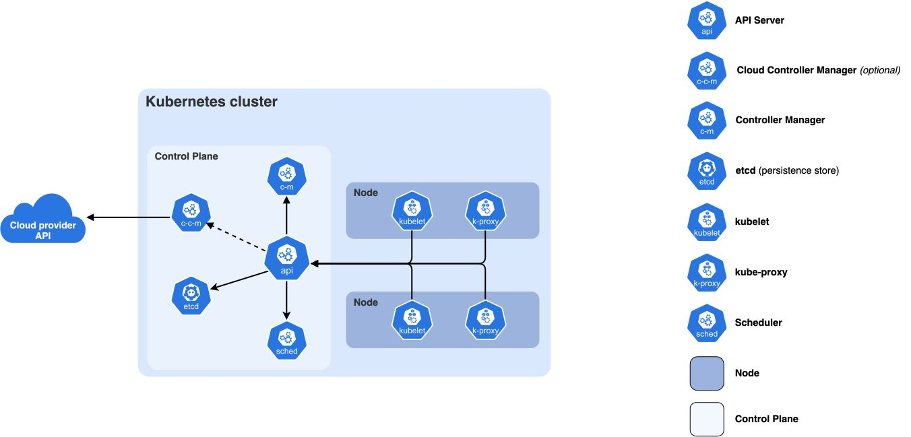

## Introduction

I spent months deploying applications to Kubernetes before I actually understood what was happening under the hood. I'd run `kubectl apply` and magic would occur. Pods would appear, services would route traffic, and my app would be running.

But when things broke (and they always do), I was debugging blind. Is this a control plane issue? A networking problem? A resource constraint? Without understanding the components, I was just googling error messages and hoping for the best.

This post is what I wish I'd read early on. Not the academic deep-dive, but the practical "here's what actually happens when you deploy" explanation.



---

## The Control Plane: Kubernetes' Brain

The control plane is where all the decisions get made. It's the brain of your cluster. In managed Kubernetes (EKS, GKE, AKS), the cloud provider runs this for you. In self-hosted setups like k3s or kubeadm, you're responsible for it.

### API Server: The Front Door

**The front door.** Every kubectl command, every controller action, every node heartbeat goes through the API server. It's the only component that talks to etcd directly.

It exposes a REST API and handles authentication, authorisation, and admission control.

**What this means in practice:**

When you run `kubectl apply -f deployment.yaml`, here's what happens:

```bash
# You run this
kubectl apply -f deployment.yaml

# kubectl converts your YAML to JSON and sends it to the API server
# The API server:
# 1. Authenticates you (are you who you say you are?)
# 2. Authorizes the request (are you allowed to create deployments?)
# 3. Validates the YAML (is this valid Kubernetes resource?)
# 4. Writes it to etcd
```

**Why it matters:** If the API server is down, you can't do anything. No kubectl commands work. The cluster is effectively frozen in its current state.

---

### etcd: The Source of Truth

**The source of truth.** etcd is a distributed key-value store that holds all cluster state: what pods exist, what nodes are healthy, what secrets are stored, what ConfigMaps are defined.

Everything in Kubernetes is stored in etcd. Lose etcd without backups, lose your cluster state.

**What this means in practice:**

etcd stores everything as key-value pairs under the `/registry` path. For example, a pod named `my-pod` in the `default` namespace would be stored at `/registry/pods/default/my-pod`. Same for deployments, secrets, and ConfigMaps.

**Why it matters:** etcd is the single source of truth. The API server is the only component that talks to etcd. Everything else goes through the API server. This ensures consistency - there's no "which version is correct?" confusion.

---

### Scheduler: The Matchmaker

When you create a pod, the Scheduler decides which node runs it. It looks at resource requirements like CPU and memory, checks node affinity rules, considers taints and tolerations, and reviews current node utilisation before making a decision.

The Scheduler doesn't actually start pods. It just assigns them to nodes by writing that decision to etcd. The kubelet on that node picks it up and does the actual work.

**What this means in practice:**

```bash
# Create a pod with resource requests
kubectl apply -f - <<EOF
apiVersion: v1
kind: Pod
metadata:
  name: my-pod
spec:
  containers:
  - name: nginx
    image: nginx
    resources:
      requests:
        memory: "512Mi"
        cpu: "500m"
EOF

# Watch the scheduler assign it
kubectl get pod my-pod -o wide
# Shows which node it was assigned to

# If no node has enough resources:
kubectl describe pod my-pod
# Shows "Pending" status with "Insufficient memory" or similar
```

**Why it matters:** The scheduler is what makes Kubernetes "smart." It distributes workloads across your cluster based on actual resource availability, not just round-robin.


---

### Controller Manager: The Reconciliation Loops

This is where the control loops live. Each controller watches a specific resource type and works to reconcile actual state with desired state:

- **Deployment Controller:** Ensures the right number of ReplicaSets exist
- **ReplicaSet Controller:** Ensures the right number of Pods exist
- **Node Controller:** Monitors node health, evicts pods from failing nodes
- **Service Controller:** Creates cloud load balancers for LoadBalancer services

**What this means in practice:**

```bash
# Create a deployment with 3 replicas
kubectl create deployment nginx --image=nginx --replicas=3

# Watch the controllers work
kubectl get pods -w
# You'll see pods being created one by one

# Delete a pod manually
kubectl delete pod <pod-name>

# Watch it get recreated automatically
kubectl get pods -w
# A new pod appears to replace the deleted one

# Check the ReplicaSet
kubectl get rs
# Shows the ReplicaSet maintaining 3 pods
```

**Why it matters:** This is Kubernetes' self-healing capability. If a pod dies, the controller notices (actual state: 2 pods, desired state: 3 pods) and creates a new one. This loop runs constantly.


---

## Worker Nodes: Where the Work Happens

While the control plane makes decisions, worker nodes actually run your workloads. In EKS, these are EC2 instances. In your home lab, it might be a single k3s node or multiple Raspberry Pis.

### kubelet: The Agent

**The agent** on every worker node. It receives pod specs from the API server, works with the container runtime to start containers, reports node and pod status back to the control plane, and runs liveness and readiness probes.

**What this means in practice:**

```bash
# Check kubelet status on a node (if you have SSH access)
systemctl status kubelet

# View kubelet logs
journalctl -u kubelet -f

# See what kubelet is managing on a node
kubectl get pods --all-namespaces --field-selector spec.nodeName=<node-name>

# Check node status reported by kubelet
kubectl describe node <node-name>
# Shows conditions like Ready, MemoryPressure, DiskPressure
```

**Why it matters:** If kubelet crashes on a node, that node becomes "NotReady." The node controller notices and evicts pods to healthy nodes. Kubelet is the critical link between the control plane and actual container execution.


---

### Container Runtime: The Executor

The container runtime actually runs your containers. Kubernetes supports multiple runtimes through the Container Runtime Interface (CRI). The most common is **containerd**, which is the modern standard used by k3s, EKS, and GKE. There's also **CRI-O**, a lightweight alternative popular in OpenShift. **Docker** still works for building images but is deprecated as a Kubernetes runtime.

**What this means in practice:**

```bash
# Check which runtime your nodes use
kubectl get nodes -o wide
# Look at the CONTAINER-RUNTIME column

# On a node, you can interact with containerd directly
sudo crictl ps  # List running containers
sudo crictl pods  # List pods
sudo crictl logs <container-id>  # View logs

# Compare with kubectl
kubectl get pods --all-namespaces
kubectl logs <pod-name>
```

**Why it matters:** You don't interact with the runtime directly in day-to-day Kubernetes use. But when debugging, knowing that `kubectl logs` actually asks containerd for logs helps understand the flow.


---

### kube-proxy: The Network Glue

kube-proxy runs on every node and manages network rules. It handles Service IP to pod IP translation, load balancing across pods, and NodePort and ClusterIP services.

**What this means in practice:**

```bash
# Create a service
kubectl expose deployment nginx --port=80 --type=ClusterIP

# Check the service endpoints
kubectl get endpoints nginx
# Shows which pods are backing the service
```

**Why it matters:** Services don't "exist" as real network entities. They're just iptables rules (or ipvs/virtual server entries) that kube-proxy maintains. When you curl a service IP, kube-proxy redirects you to an actual pod.


---

## How It All Connects: A Pod Creation Story

Let's trace what happens when you deploy an application:

```bash
# You run this
kubectl apply -f deployment.yaml
```

**Step 1 - API Server:**
```
kubectl → API Server → etcd (stores Deployment resource)
```

**Step 2 - Controller Manager:**
```
Deployment Controller watches for new Deployments
→ Creates ReplicaSet
→ Writes to etcd via API Server
```

**Step 3 - More Controller Manager:**
```
ReplicaSet Controller watches for new ReplicaSets
→ Creates Pod resources (3 replicas)
→ Writes to etcd via API Server
```

**Step 4 - Scheduler:**
```
Scheduler watches for unassigned Pods
→ Checks node resources
→ Assigns each pod to a node
→ Writes assignment to etcd via API Server
```

**Step 5 - kubelet:**
```
kubelet on assigned node watches for pods assigned to it
→ Sees new pod assignment
→ Calls container runtime (containerd)
→ Pulls image, starts container
→ Reports status back to API Server
```

**Step 6 - kube-proxy:**
```
kube-proxy on all nodes watches for new Services
→ Creates iptables rules for service IP
→ Load balances to pod IPs
```

**Result:** Your app is running and accessible!


---

## Why This Matters for EKS

In managed Kubernetes like EKS:

**AWS manages the control plane:** the API Server running across multiple availability zones for high availability, etcd with automated backups and encryption, the Scheduler, and the Controller Manager.

**You manage (the data plane):**
- Worker nodes (EC2 instances)
- kubelet on each node
- Container runtime on each node
- kube-proxy on each node

**What this means:**

```bash
# You can't SSH into control plane components in EKS
# But you can see they're working:
kubectl get componentstatuses
# Shows scheduler and controller-manager status

# You CAN SSH into worker nodes (if needed)
# Useful for debugging kubelet or container runtime issues

# EKS manages etcd backups for you
# But you should still back up your own application data!
```


---

## Why This Matters for Your Home Lab

In self-hosted Kubernetes (k3s, kubeadm, etc.):

**You manage everything.**

This is actually great for learning. When you run k3s on a single node, that node runs:
- API Server
- etcd
- Scheduler
- Controller Manager
- kubelet
- Container runtime
- kube-proxy

All on one machine. You can see all the logs, break things, fix them, and really understand how they interact.

**What this means:**

```bash
# In k3s, everything runs as systemd services
systemctl status k3s

# You can see all the control plane logs
sudo journalctl -u k3s -f

# etcd data is stored locally
sudo ls -la /var/lib/rancher/k3s/server/db/

# You can back it up yourself
sudo k3s etcd-snapshot save
```


---

## Key Takeaways

1. **API Server is the gateway** - Everything goes through it. If it's down, the cluster is frozen.

2. **etcd is the truth** - All state lives here. Back it up.

3. **Controllers are loops.** They constantly watch and reconcile. This is the "self-healing" magic.

4. **Scheduler just assigns** - It doesn't start pods, just decides where they go.

5. **kubelet does the work** - It actually starts containers on nodes.

6. **kube-proxy handles networking** - Services are just iptables rules.

Understanding these components helps you:
- Debug faster (is this a control plane issue or a node issue?)
- Design better (should I run this on control plane or separate it?)
- Troubleshoot effectively (check component logs, not just pod logs)

---

## What's Next?

Now that you understand the components, check out my other posts:

- **[Building a Three-Tier App on EKS](/blog/3-tier-eks-microservices)** - See these concepts in action with a real production deployment

If you want to go deeper, the [Kubernetes documentation](https://kubernetes.io/docs/concepts/overview/components/) is excellent. But best way I learnt? Deploy something, break something, fix it. Enjoy the journey man!
