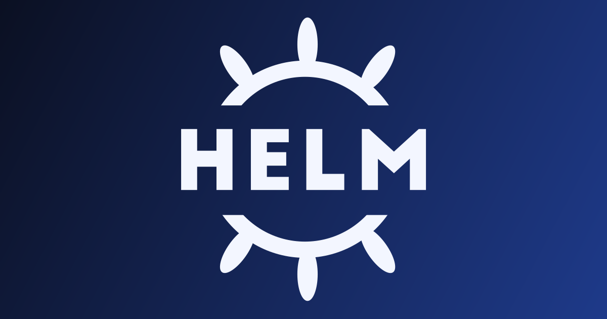

# What is Helm?

Helm is a package manager for Kubernetes. Think of it like `apt` for Ubuntu or `brew` for macOS, but for Kubernetes apps.

Instead of manually writing and applying many YAML files, Helm lets you install an app from a reusable package called a **chart**. A chart contains templates, defaults, and metadata for deploying an application.

## How helm install works

When you run `helm install`, Helm acts as the brain of the workflow:

1. It pulls the chart (from a Helm repo, local folder, or `.tar.gz`).
2. It renders templates locally using your values (`values.yaml` and/or `--set`).
3. It sends final manifests directly to the Kubernetes API server using your kubeconfig permissions.
4. It stores release state in a Kubernetes Secret in the target namespace.

That Secret includes:

- The chart used
- The values you passed
- The release revision (v1, v2, v3, ...)

You can inspect Helm release secrets with:

```bash
kubectl get secrets -l "owner=helm" -A
```

You will see names like:

```text
sh.helm.release.v1.my-app.v1
```

This is how Helm remembers state for upgrades and rollbacks without an external database.

## Quick demo: install something real

Here is a simple example using Bitnami NGINX:

```bash
# 1) Add a chart repo
helm repo add bitnami https://charts.bitnami.com/bitnami
helm repo update

# 2) Install into a namespace
helm install web bitnami/nginx -n demo --create-namespace

# 3) Confirm resources
kubectl get all -n demo

# 4) Confirm Helm release tracking
helm list -n demo
kubectl get secrets -n demo -l "owner=helm"
```

This flow shows the practical loop: install the app, confirm Kubernetes resources are running, then confirm Helm recorded the release correctly.

## How helm upgrade works

`helm upgrade` is smarter than a blind overwrite. Helm compares:

- Old state (stored release Secret)
- Live state (what is running now)
- New chart + new values

Then it computes what changed and sends targeted patches.

Example: if only the image tag changed, Helm patches the Deployment and usually leaves unrelated resources alone.

Because Helm 3 uses a three-way merge approach, it can often preserve safe live changes (like a manual scale) unless your new chart explicitly conflicts.

After a successful upgrade, Helm writes a new release revision Secret (for example, from `v1` to `v2`).

That is why rollback is easy:

```bash
helm rollback my-app 1
```

Helm re-applies manifests from the stored previous revision.

## Practical commands to use

```bash
# Install
helm install my-app ./chart -n demo --create-namespace

# Preview without applying
helm upgrade --install my-app ./chart -n demo --dry-run

# See release history
helm history my-app -n demo
```

If you want a cleaner preview of upgrades, use the `helm-diff` plugin before applying changes.

## Final take

Helm is valuable because it makes Kubernetes deployments repeatable, versioned, and reversible. You get faster app delivery with safer upgrades and rollback built in.
